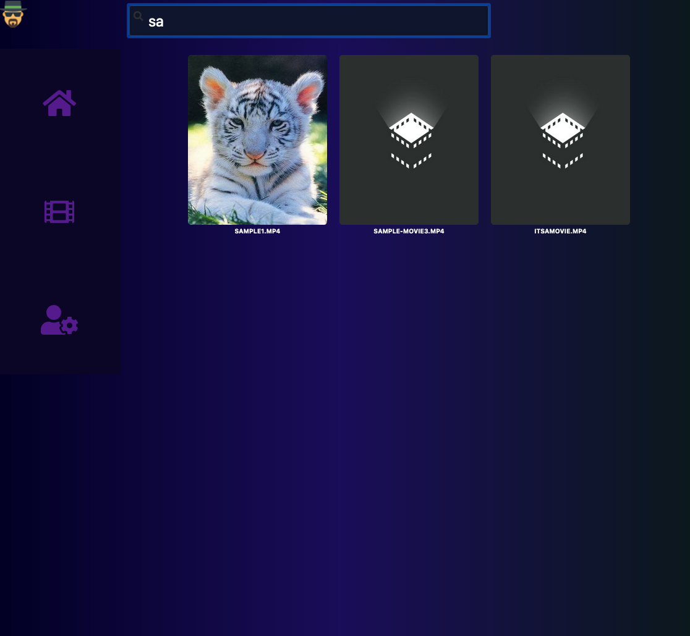
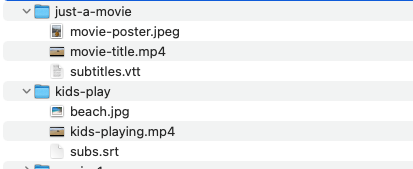

[](https://github.com/eliasjunior/home-video/actions/workflows/tests.yml)
<br />
<p align="center">
  <a href="https://github.com/eliasjunior/home-video-api/blob/master/public/movies.png">
    
  </a>

  <h3 align="center">Home Video</h3>

  <p align="center">
    It's a web application to play videos on a browser, it's easy to install and setup, access the videos on the phone, computer or anything else that has a browser.
    <br />
    <br />
  </p>
</p>

<!-- TABLE OF CONTENTS -->
<details open="open">
  <summary>Table of Contents</summary>
  <ol>
    <li>
      <a href="#about-the-project">About The Project</a>
      <ul>
        <li><a href="#built-with">Built With</a></li>
      </ul>
    </li>
    <li>
      <a href="#getting-started">Getting Started</a>
      <ul>
        <li><a href="#prerequisites">Prerequisites</a></li>
        <li><a href="#installation">Installation</a></li>
      </ul>
    </li>
    <li><a href="#usage">Usage</a></li>
  </ol>
</details>


<!-- ABOUT THE PROJECT -->
## About The Project
<p align="center">
    <a href="https://github.com/eliasjunior/home-video-docs/blob/main/images/design.png">
        
    </a>
</p>

</br>

Mobile 

<p align="center">
    <a href="https://github.com/eliasjunior/home-video-docs/blob/main/images/home.png">
        
    </a>
    <a href="https://github.com/eliasjunior/home-video-docs/blob/main/images/list.png">
        
    </a>
    <a href="https://github.com/eliasjunior/home-video-docs/blob/main/images/list-search.png">
        
    </a>
</p>
<p align="center">
    <a href="https://github.com/eliasjunior/home-video-docs/blob/main/images/player.png">
        
    </a>
</p>

Desktop
<p align="center">
    <a href="https://github.com/eliasjunior/home-video-docs/blob/main/images/desktop.png">
        
    </a>
    <a href="https://github.com/eliasjunior/home-video-docs/blob/main/images/desktop-list.png">
        
    </a>
    <a href="https://github.com/eliasjunior/home-video-docs/blob/main/images/desktop-list-search.png">
        
    </a>
</p>

Probably there are many great apps to stream video just like this one but I wanted to learn a bit about video streaming,  on the front-end and back-end.

Here's why:
* Build something that I enjoy doing so.
* Apply good code practices because I want flexibility to change and evolve the code.
* Play with React and Node.
* I have a bunch of videos on my hard drive and I was curious to how I could build something to access it.


### Built With
* [React](https://reactjs.org/)
* [NodeJs](https://nodejs.org/)


<!-- GETTING STARTED -->
## Getting Started

### Prerequisites

Cheap computer as Raspberry PI or any other computer that you might have.
NodeJs 10 or higher installed on the machine that will run the apps

* Download [NodeJS](https://nodejs.org)  and follow the steps.

### Installation

<li><a href="https://github.com/eliasjunior/home-video-api" target="_blank">Node App</a></li>

1. Clone the NodeJs App (back-end)
   ```sh
   git clone https://github.com/eliasjunior/home-video-api.git
   ```
2. Edit .env with your configuration

```properties
REACT_APP_SERVER_HOST=YOUR_MACHINE_IP_ADDRESS
REACT_APP_SERVER_PROTOCOL=http
```
3. Install NPM packages, run the command bellow.
   ```sh
   npm install
   ```
4. More details of the configuration you can find in `src/config.js`   

5. Folder structure must follow the structure bellow, images and subtitles at the same folder.

    <a href="https://github.com/eliasjunior/home-video-docs/blob/main/images/folder.png">
            
    </a>

<li><a href="https://github.com/eliasjunior/home-video" target="_blank">React App</a></li>

1. Clone the React App (Front-end)
   ```sh
   git clone https://github.com/eliasjunior/home-video.git
   ```
2. Install NPM packages, run the command bellow on both projects in the root folder.
   ```sh
   npm install
   ```
3. More details of the configuration you can find in `src/config.js`


<!-- Technical -->
## Technical overview

<li><a href="https://github.com/eliasjunior/home-video" target="_blank">React App Choices</a></li>

### Frameworks and Libs

React
1. Positive personal experience and I found that framework.
2. It embraces reusability  and testability.
3. It lets you to use your JavaScript know-how and relying strongly in the language instead of apis on the top of the language


<!-- LICENSE -->
## License

Distributed under the MIT License. See `LICENSE` for more information.
