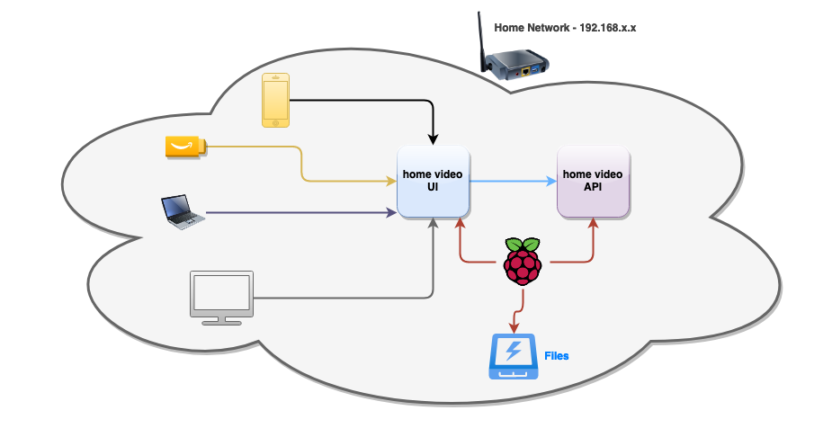
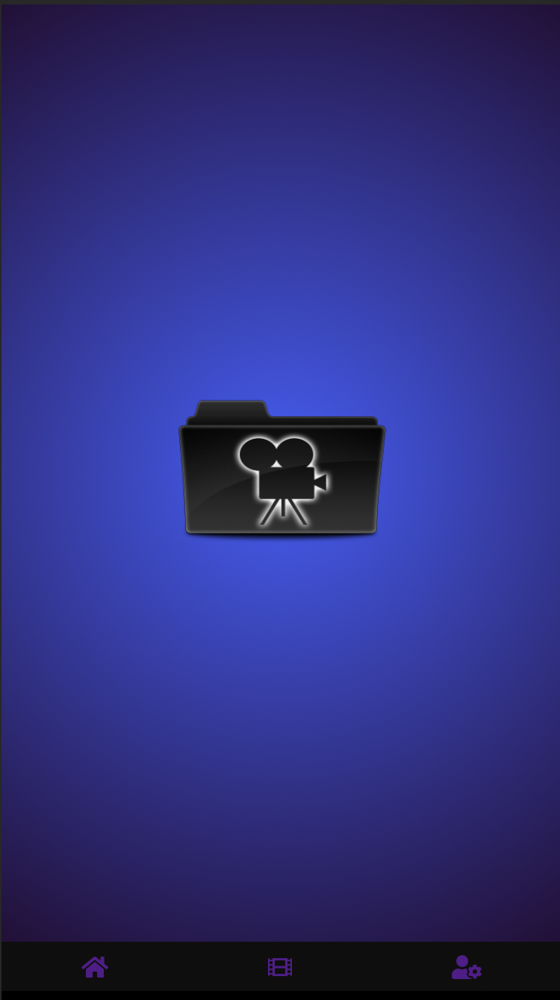
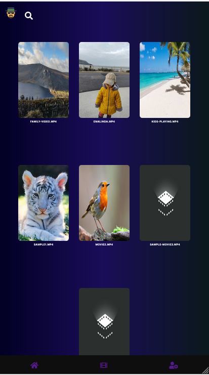
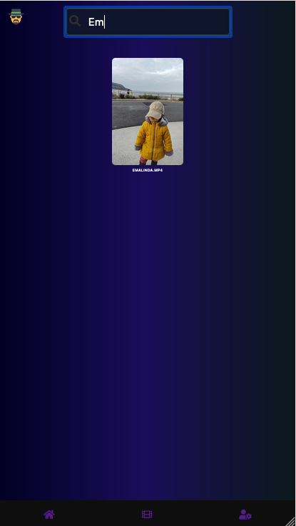
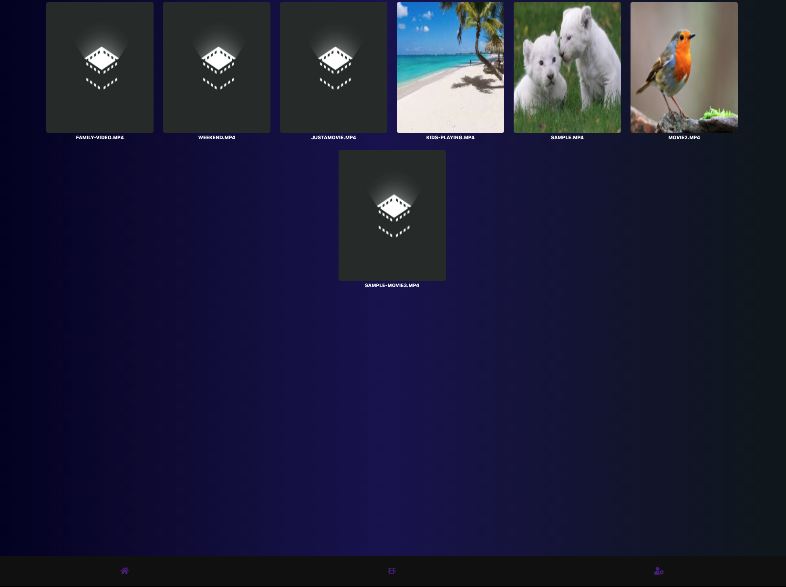
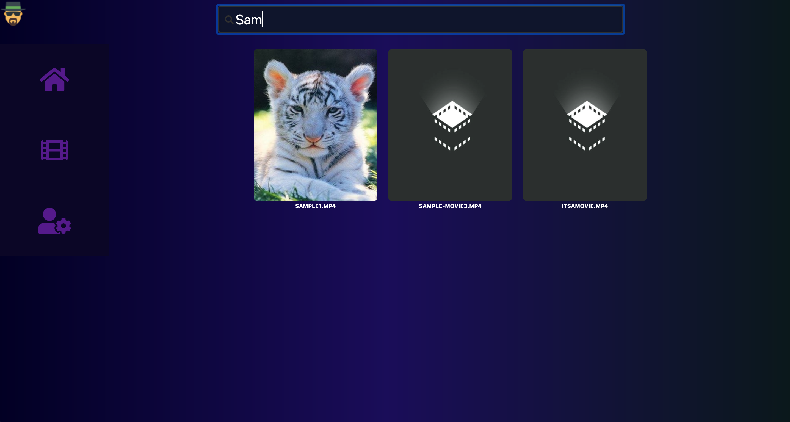
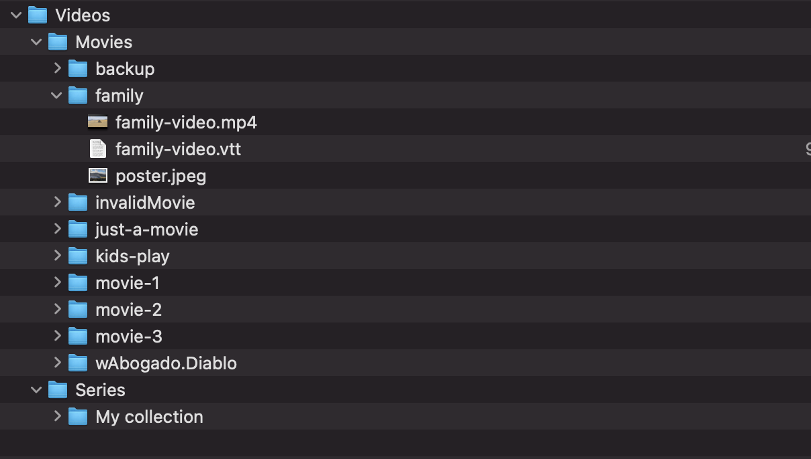

[](https://github.com/eliasjunior/home-video/actions/workflows/tests.yml)
<br />
<p align="center">
  <a href="https://github.com/eliasjunior/home-video-api/blob/master/public/movies.png">
    
  </a>

  <h3 align="center">Home Video</h3>

  <p align="center">
    It's a web application to play videos on a browser, it's easy to install and setup, access the videos in the phone, computer or anything else, you just need a browser.
    <br />
    <br />
  </p>
</p>

<!-- TABLE OF CONTENTS -->
<details open="open">
  <summary>Table of Contents</summary>
  <ol>
    <li>
      <a href="#about-the-project">About The Project</a>
      <ul>
        <li><a href="#built-with">Built With</a></li>
      </ul>
    </li>
    <li>
      <a href="#getting-started">Getting Started</a>
      <ul>
        <li><a href="#prerequisites">Prerequisites</a></li>
        <li><a href="#installation">Installation</a></li>
      </ul>
    </li>
    <li><a href="#usage">Usage</a></li>
  </ol>
</details>


<!-- ABOUT THE PROJECT -->
## About The Project
<p align="center">
    <a href="https://github.com/eliasjunior/home-video-docs/blob/main/images/design.png">
        
    </a>
</p>

</br>

Mobile 

<p align="center">
    <a href="https://github.com/eliasjunior/home-video-docs/blob/main/images/home.png">
        
    </a>
    <a href="https://github.com/eliasjunior/home-video-docs/blob/main/images/list.png">
        
    </a>
    <a href="https://github.com/eliasjunior/home-video-docs/blob/main/images/list-search.png">
        
    </a>
</p>
<p align="center">
    <a href="https://github.com/eliasjunior/home-video-docs/blob/main/images/player.png">
        
    </a>
</p>

Desktop
<p align="center">
    <a href="https://github.com/eliasjunior/home-video-docs/blob/main/images/desktop.png">
        
    </a>
    <a href="https://github.com/eliasjunior/home-video-docs/blob/main/images/desktop-list.png">
        
    </a>
    <a href="https://github.com/eliasjunior/home-video-docs/blob/main/images/desktop-list-search.png">
        
    </a>
</p>

Probably there are many great apps to stream video out there, but I wanted to learn a bit about video streaming and was curious on how the pieces come together.

Here's what motivated me:
* Build something that I enjoy doing so.
* Apply good code practices because I wanted flexibility to change and evolve the app over time as the app grows.
* Play with React and Node.
* I have a bunch of videos and photos in my hard drive and I was curious to how hard would be to build something to easily access it.


### Built With
* [React](https://reactjs.org/) - [Front-end App](https://github.com/eliasjunior/home-video)
* [NodeJs](https://nodejs.org/) - [Back-end App](https://github.com/eliasjunior/home-video-api)


<!-- GETTING STARTED -->
## Getting Started

### Prerequisites

Cheap computer as Raspberry PI or any other computer that you might have.
NodeJs 10 or higher installed on the machine that will run the apps

* Download [NodeJS](https://nodejs.org)  and follow the steps.

### Installation(Production environment)

<li><a href="https://github.com/eliasjunior/home-video-api" target="_blank">Node App</a></li>

1. Clone the NodeJs App (back-end)
    ```sh
    git clone https://github.com/eliasjunior/home-video-api.git
    ```

2. Edit .env with your configuration

    ```properties
    SERVER_HOST=YOUR_MACHINE_IP_ADDRESS
    SERVER_PROTOCOL=http
    SERVER_PORT=8080
    IMG_FOLDER_FALL_BACK=/Images
    VIDEO_PATH=Absolute videos path
    MOVIES_DIR=Movies folder
    SERIES_DIR=Series folder
    VIDEO_PATH_LOCAL=Local path, for development
    IMG_FOLDER_FALL_BACK= leave it blank if you don't want the app to read video/images from another folder
    ```

3. More details of the configuration you can find in `src/config.js`  

4. The folder structure must follow the structure bellow, images and subtitles at the same folder.

    <a href="https://github.com/eliasjunior/home-video-docs/blob/main/images/files-structure.png">
            
    </a>


5. Install NPM packages, run the command bellow.
    ```sh
    npm install
    ```

6. Run app    
 ```sh
   npm start
 ```
<li><a href="https://github.com/eliasjunior/home-video" target="_blank">React App</a></li>

1. Clone the React App (Front-end)
    ```sh
    git clone https://github.com/eliasjunior/home-video.git
    ```

2. Edit .env with your configuration   
    ```properties
    REACT_APP_SERVER_HOST=YOUR_SERVER_IP_ADDRESS
    REACT_APP_SERVER_PROTOCOL=http
    ```

3. More details of the configuration you can find in `src/config.js`  

4. Install NPM packages.
    ```sh
      npm install
    ```

5. Build the App
    ```sh
      npm run build
    ```

6. Run app    
    ```sh
      npm start
    ```

<!-- Technical -->
## Technical overview

<li><a href="https://github.com/eliasjunior/home-video" target="_blank">React App</a></li>

### Frameworks and Libs

React

* Positive personal experience.
* Instability
* It embraces reusability, testability and Javascript native features instead of adding a api layer.

CSS

* No CSS libraries
* BEM for css standards
* Mainly for layouts I used Flexbox

<li><a href="https://github.com/eliasjunior/home-video" target="_blank">Server App</a></li>

* Develop something quickly.
* Javascript experience
* Full stack javascript

<!-- LICENSE -->
## License

Distributed under the MIT License. See `LICENSE` for more information.
